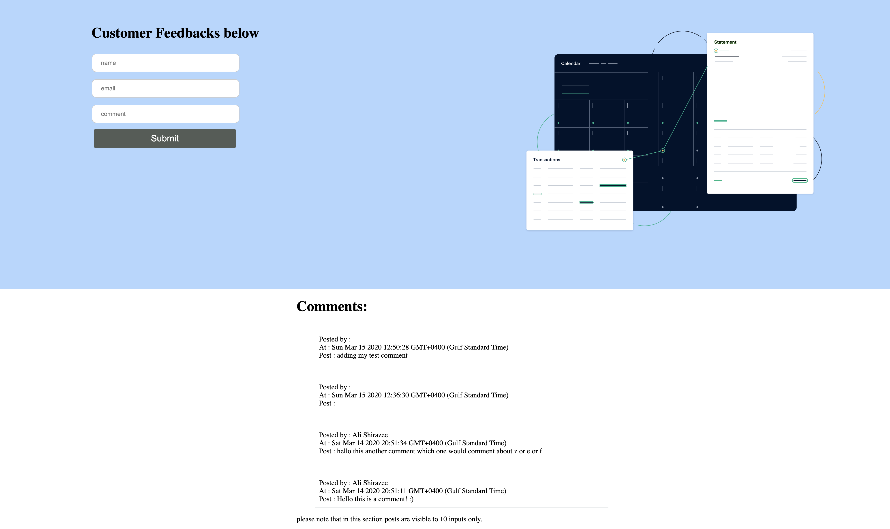

# Customer feedback form with SVG animations and firebase

##### Setup node modules

```
npm install
```

##### Compiles and runs at http://localhost:4000/

```
npm start
```

## About
React js Responsive web app, contains SVG Animations in two ways, first with in the CSS code and second with in the state. The allows users to publish comments and diplays them on the comments section with a timestamp leveraging firebase.





